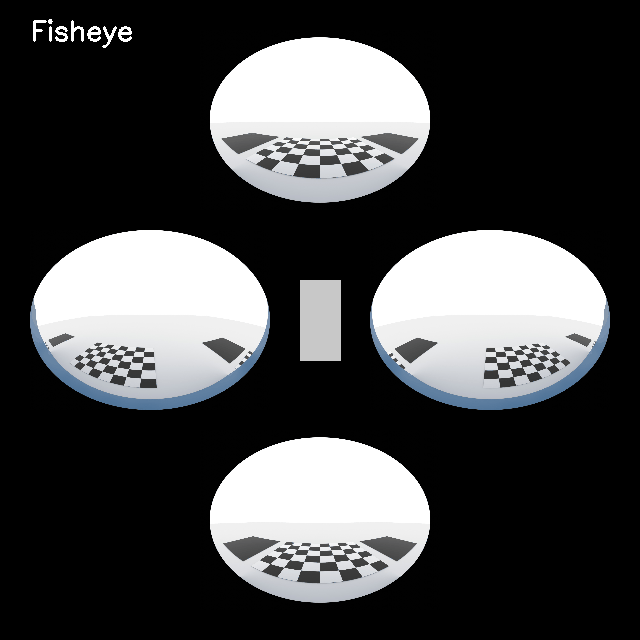
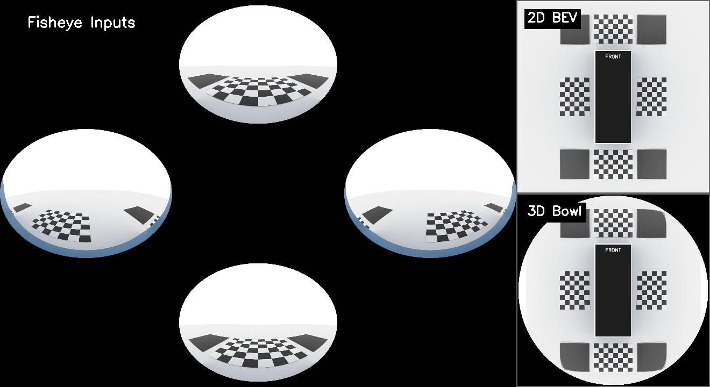

# Open-3D-Surround-View

## What is this?
This repository contains a complete, end-to-end Python pipeline for generating **Automated Fisheye Camera Calibration** and simulating a **Surround-View Monitor (SVM)** system.

Instead of just showing the mathematics, this repository gives you the actual tools to run a synthetic car through an advanced visualization engine. It takes input from 4 fisheye cameras (Front, Back, Left, Right), maps them perfectly to a physical ground plane (2D Bird's-Eye View), and even extrudes them onto a curved topology (3D Bowl View) for a complete parking dashboard UX.

## Quick Start
Don't worry about configuring OpenCV or placing checkerboards just yet. Simply run the built-in demo which uses pre-calibrated sample data to instantly stitch a perfect surround-view image.

```bash
git clone https://github.com/nick8592/Open-3D-Surround-View.git
cd Open-3D-Surround-View
python3 demo/demo.py
```

*This parses the `data/sample/` pre-calibrated images, calculates the math, and outputs both a 2D Ground mapped image (`demo/demo_bev.png`) and a 3D Curved Topology image (`demo/demo_bowl.png`).*

## Demo Output

### End-to-End Visual Pipeline
*(Original Fisheye Feeds → 2D BEV → 3D SVM)*


### Cinematic 3D Turntable Render
*(The optional `render_cinematic.py` script exports a dynamic flying camera video of the 3D topology)*
<video src="https://github.com/user-attachments/assets/35f90aa1-d96d-47a8-9ade-5cfca9fb7e03" controls="controls" muted="muted" style="max-height:640px;"></video>

### Comparison (Raw vs Generated Views)


## Installation
To run the full pipeline (including capturing your own synthetic chessboard data), you will need **Blender** and **Python 3**.

### Option A: Local Setup
1. Install [Blender (3.6+ recommended)](https://www.blender.org/download/). Ensure `blender` is accessible via your system PATH.
2. Install Python dependencies:
```bash
pip install -r requirements.txt
```

### Option B: Docker & DevContainer (Recommended)
This avoids all dependency conflicts (Blender and OpenCV come pre-installed).

**Using an IDE (e.g. VS Code):**
Simply open the repository folder in VS Code and click **Reopen in Container** when prompted. The pre-configured `.devcontainer` will automatically build the isolated environment so you can run scripts and use the terminal directly from your editor!

**Using CLI Docker:**
```bash
docker build -t open3dsv .
docker run -it -v $(pwd):/app open3dsv
```
*(Or use `docker compose run --rm svm_container bash`). Everything generated inside the container will automatically sync to your host machine!*

## Full Pipeline Usage
If you want to run the core stitching and projection engine on existing calibrated parameters, follow this sequence:

### Step 1: Generate 2D BEV (Flat Ground)
Maps the 4 camera perspectives down to flat ground and creates highly optimized Look-Up Tables (LUTs) for rendering.
```bash
python3 scripts/bev_2d/stitching_bev.py
```
*(Check `data/bev_2d/bev.png`)*

### Step 2: Render 2D BEV (Simulated Real-Time)
Uses the generated LUTs to render continuous composite frames (to simulate a real car driving).
```bash
python3 scripts/bev_2d/render_bev.py
```
*(Performance on Apple Silicon (VirtualApple @ 2.50GHz): ~74 FPS)*

### Step 3: Build & Stitch 3D Bowl
Mathematically calculates the 3D topology and projects the camera textures onto the curved walls to fix edge stretching.
```bash
python3 scripts/bowl_3d/build_bowl.py
python3 scripts/bowl_3d/stitching_bowl.py
```

### Step 4: Render 3D Bowl (Simulated Real-Time)
Uses the 3D LUTs to render the final unified dashboard display!
```bash
python3 scripts/bowl_3d/render_bowl.py
```
*(Performance on Apple Silicon (VirtualApple @ 2.50GHz): ~42 FPS)*

## Blender Rendering & Previews (Optional)
Once you have generated the 3D bowl topology (`svm_pure_bowl.obj`) and matching texture (`bowl_texture.png`), you can use these Blender scripts to visually examine or showcase your results.

### Preview 3D Bowl Geometry
Opens the Blender GUI with the generated OBJ and textures automatically loaded, enforcing proper ISO 8855 Automotive axes. Useful for debugging your bowl topology structure.
```bash
blender -P scripts/blender_render/preview_3d_bowl.py
```

### Render Cinematic Turntable Animation
Executes a simulated "flying chase camera" spin around the 3D Bowl layout in headless mode and exports an MP4 cinematic video.
```bash
blender -b -P scripts/blender_render/render_cinematic.py
```

## Calibration Guide
If you want to re-calibrate the cameras or change their physical locations on the car, you must generate new `K`, `D`, `rvec`, and `tvec` matrices.

### Intrinsic Calibration (Lens Distortion)
Computes the internal properties of the fisheye lens (`K` and `D`).
```bash
# 1. Synthetically capture checkerboards using Blender
blender -b scenes/calib_intrinsic.blend -P scripts/synthetic_capture/capture_intrinsic.py

# 2. Run OpenCV mathematical solver
python3 scripts/calibration/calibrate_intrinsic.py

# 3. Evaluate the calibration (plumb-line curvature)
python3 scripts/calibration/evaluate_intrinsic.py
```

### Extrinsic Calibration (Physical Camera Setup)
Computes the physical (X, Y, Z, Yaw, Pitch, Roll) orientation of the cameras mapped to the ISO 8855 automotive standard.
```bash
# 1. Capture the 4 cameras looking at the floor checkerboards
blender -b scenes/svm_v1.blend -P scripts/synthetic_capture/capture_extrinsic.py

# 2. Run OpenCV mathematical solver 
python3 scripts/calibration/calibrate_extrinsic.py

# 3. Evaluate the calibration (3D sub-pixel reprojection error)
python3 scripts/calibration/evaluate_extrinsic.py
```

## Advanced Usage

### Centralized Configuration (`config.py`)
If you change the physical size of the vehicle, or want to tweak the projection curves and masking, open the `config.py` file in the root directory and adjust the centralized parameters. All rendering scripts will automatically read from this single source of truth:
```python
# Car Dimensions (For UI Overlay and masking)
CAR_LENGTH = 4.8  # Meters
CAR_WIDTH = 1.9   # Meters

# 3D Bowl Specific Parameters
FLAT_MARGIN = 1.5      # Meters of flat ground around the car before curvature starts
BOWL_STEEPNESS = 0.5   # Exponent/Multiplier for how fast the edges curve upwards
```

### Checking Photometric Error
To mathematically evaluate the exact sub-pixel overlap precision where the 4 camera fields-of-view blend together:
```bash
python3 scripts/bev_2d/evaluate_bev.py
```
*(This will generate a visual error heatmap in `data/bev_2d/debug/`)*

### Further Reading
For exact mathematical explanations of how the projections, intrinsic distortions, and Extrinsic 3D math work, see the `docs/` folder!

## License

This project is licensed under the [MIT License](LICENSE).
