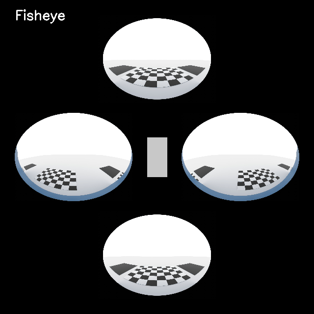
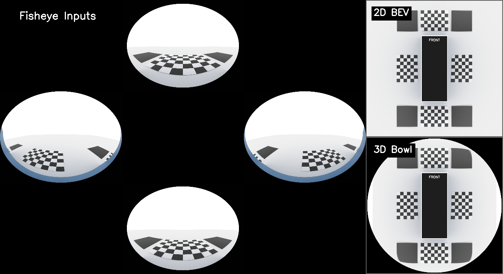

# Open-3D-Surround-View

## What is this?
This repository contains a complete, end-to-end Python pipeline for generating **Automated Fisheye Camera Calibration** and simulating a **Surround-View Monitor (SVM)** system.

Instead of just showing the mathematics, this repository gives you the actual tools to run a synthetic car through an advanced visualization engine. It takes input from 4 fisheye cameras (Front, Back, Left, Right), maps them perfectly to a physical ground plane (2D Bird's-Eye View), and even extrudes them onto a curved topology (3D Bowl View) for a complete parking dashboard UX.

## Quick Start
Don't worry about configuring OpenCV or placing checkerboards just yet. Simply run the built-in demo which uses pre-calibrated sample data to instantly stitch a perfect surround-view image.

```bash
git clone https://github.com/nick8592/Open-3D-Surround-View.git
cd Open-3D-Surround-View
python3 demo/demo.py
```

*This parses the `data/sample/` pre-calibrated images, calculates the math, and outputs both a 2D Ground mapped image (`demo/demo_bev.png`) and a 3D Curved Topology image (`demo/demo_bowl.png`).*

## Demo Output

### End-to-End Visual Pipeline
*(Original Fisheye Feeds → 2D BEV → 3D SVM)*


### Cinematic 3D Turntable Render
*(The optional `render_cinematic.py` script exports a dynamic flying camera video of the 3D topology)*
<video src="https://github.com/user-attachments/assets/35f90aa1-d96d-47a8-9ade-5cfca9fb7e03" controls="controls" muted="muted" style="max-height:640px;"></video>

### Comparison (Raw vs Generated Views)


## Installation
To run the full pipeline (including capturing your own synthetic chessboard data), you will need **Blender** and **Python 3**.

> **⚠️ Caution on Blender Versions:**  
> If you plan to customize the synthetic environment by editing `.blend` files on your host machine, **you must use the exact same version of Blender (or at least the 3.6.x LTS series)** as the container. If you save a scene using a newer local version of Blender, the Docker container's synthetic capture scripts will fail to read it (throwing a `not a blend file` error).

### Option A: Local Setup
1. Install [Blender (3.6+ recommended)](https://www.blender.org/download/). Ensure `blender` is accessible via your system PATH.
2. Install Python dependencies:
```bash
pip install -r requirements.txt
```

### Option B: Docker & DevContainer (Recommended)
This avoids all dependency conflicts (Blender and OpenCV come pre-installed).

**Using an IDE (e.g. VS Code):**
Simply open the repository folder in VS Code and click **Reopen in Container** when prompted. The pre-configured `.devcontainer` will automatically build the isolated environment so you can run scripts and use the terminal directly from your editor!

> **Hardware Warning (Nvidia GPU Passthrough):**  
> By default, the `devcontainer.json` and `docker-compose.yml` are configured to pass an Nvidia GPU into the container (`runArgs: ["--gpus", "all"]`) to achieve maximum FPS in the OpenGL rendering pipeline.  
> * **If you are on Mac Apple Silicon** or an **AMD/Intel GPU**, Docker may throw a `could not select device driver` error upon building.  
> * **To fix this:** Simply open `.devcontainer/devcontainer.json` and `docker-compose.yml`, delete the `runArgs`/`deploy` blocks, and rebuild! The software renderer (`llvmpipe`) will still easily hit ~140 FPS on your CPU.

**Using CLI Docker:**
```bash
docker build -t open3dsv .
docker run -it -v $(pwd):/app open3dsv
```
*(Or use `docker compose run --rm svm_container bash`). Everything generated inside the container will automatically sync to your host machine!*

## Full Pipeline Usage
If you want to run the core stitching and projection engine on existing calibrated parameters, follow this sequence:

### One-Command Runner (`run_pipeline.sh`)
The `run_pipeline.sh` script executes all stages sequentially with a single command:

```bash
# Run the full pipeline (capture stage requires a Blender .blend scene file)
./run_pipeline.sh --scene scenes/svm_v1.blend

# Skip capture and use existing calibration data
./run_pipeline.sh --skip-capture

# Re-run only extrinsic (intrinsic already done)
./run_pipeline.sh --scene scenes/svm_v1.blend --skip-capture-intrinsic --skip-calibrate-intrinsic

# Run only BEV and Bowl stages (e.g. when calibration is already done)
./run_pipeline.sh --skip-capture --skip-calibration
```

**Stage-level flags** (skip entire stage):
| Flag | Description |
|---|---|
| `-s, --scene <file>` | Path to Blender `.blend` scene (required for capture stage) |
| `--skip-capture` | Skip entire synthetic capture stage |
| `--skip-calibration` | Skip entire calibration stage |
| `--skip-bev` | Skip entire BEV 2D stage |
| `--skip-bowl` | Skip entire Bowl 3D stage |
| `--skip-gpu` | Skip GPU asset export stage |

**Step-level flags** (skip individual scripts within a stage):
| Flag | Skips |
|---|---|
| `--skip-capture-intrinsic` | `capture_intrinsic.py` |
| `--skip-capture-extrinsic` | `capture_extrinsic.py` |
| `--skip-calibrate-intrinsic` | `calibrate_intrinsic.py` |
| `--skip-calibrate-extrinsic` | `calibrate_extrinsic.py` |
| `--skip-bev-stitch` | `stitching_bev.py` |
| `--skip-bev-render` | `render_bev.py` |
| `--skip-bowl-build` | `build_bowl.py` |
| `--skip-bowl-stitch` | `stitching_bowl.py` |
| `--skip-bowl-render` | `render_bowl.py` |

The steps below document each stage individually if you prefer to run them manually.

### Step 1: Generate 2D BEV (Flat Ground)
Maps the 4 camera perspectives down to flat ground and creates highly optimized Look-Up Tables (LUTs) for rendering.
```bash
python3 pipeline/bev_2d/stitching_bev.py
```
*(Check `data/bev_2d/bev.png`)*

### Step 2: Render 2D BEV (Simulated Real-Time)
Uses the generated LUTs to render continuous composite frames (to simulate a real car driving).
```bash
python3 pipeline/bev_2d/render_bev.py
```
*(Performance on Apple Silicon (VirtualApple @ 2.50GHz): ~74 FPS)*

### Step 3: Build & Stitch 3D Bowl
Mathematically calculates the 3D topology and projects the camera textures onto the curved walls to fix edge stretching.
```bash
python3 pipeline/bowl_3d/build_bowl.py
python3 pipeline/bowl_3d/stitching_bowl.py
```

### Step 4: Render 3D Bowl (Simulated Real-Time)
Uses the CPU-based CV2 Look-Up Tables to render the unified dashboard display (Python / OpenCV execution path).
```bash
python3 pipeline/bowl_3d/render_bowl.py
```
*(Performance on Apple Silicon (VirtualApple @ 2.50GHz): ~42 FPS)*

### Step 5: Render 3D Bowl (Hardware GPU Accelerated)
A production-grade rendering pipeline via OpenGL. This offloads the pixel-mapping LUT computations and image blending strictly to GLSL shaders, enabling massively parallel processing performance across the vehicle UI.
```bash
# 1. Convert CPU Arrays to Raw Binary Float Maps (.bin) for the graphics card
python3 pipeline/gpu_render/export_gpu_assets.py

# 2. Render utilizing PyOpenGL Hardware Shaders 
# Note: If you are running strictly headless inside the Docker container, use xvfb-run to simulate a display buffer:
xvfb-run -s "-screen 0 1280x720x24" python3 pipeline/gpu_render/render_bowl_opengl.py

# If you are running natively on a host machine with a GUI and GPU attached, simply run:
# python3 pipeline/gpu_render/render_bowl_opengl.py
```
*(Check `data/gpu_assets/debug/gpu_preview.png` to see the resulting composite frame output, and look at the terminal output to verify if your hardware GPU was successfully detected and what your exact FPS benchmark is!)*

## Blender Rendering & Previews (Optional)
Once you have generated the 3D bowl topology (`svm_pure_bowl.obj`) and matching texture (`bowl_texture.png`), you can use these Blender scripts to visually examine or showcase your results.

### Preview 3D Bowl Geometry
Opens the Blender GUI with the generated OBJ and textures automatically loaded, enforcing proper ISO 8855 Automotive axes. Useful for debugging your bowl topology structure.
```bash
# Note: Since this opens a GUI, if you are running in a headless Docker environment 
# without X11 forwarding, you must use xvfb-run to simulate a display buffer:
xvfb-run -a blender -P pipeline/blender_render/preview_3d_bowl.py

# If running natively with a display:
# blender -P pipeline/blender_render/preview_3d_bowl.py
```

### Render Cinematic Turntable Animation
Executes a simulated "flying chase camera" spin around the 3D Bowl layout in headless mode and exports an MP4 cinematic video.
```bash
# Note: Even in background mode (-b), Blender requires a display server in Docker. Use xvfb-run:
xvfb-run -a blender -b -P pipeline/blender_render/render_cinematic.py

# If running natively:
# blender -b -P pipeline/blender_render/render_cinematic.py
```

## Calibration Guide
If you want to re-calibrate the cameras or change their physical locations on the car, you must generate new `K`, `D`, `rvec`, and `tvec` matrices.

### Intrinsic Calibration (Lens Distortion)
Computes the internal properties of the fisheye lens (`K` and `D`).
```bash
# 1. Synthetically capture checkerboards using Blender
# Note: If running inside the headless Docker container, use xvfb-run:
xvfb-run -a blender -b scenes/calib_intrinsic.blend -P pipeline/synthetic_capture/capture_intrinsic.py

# If running natively:
# blender -b scenes/calib_intrinsic.blend -P pipeline/synthetic_capture/capture_intrinsic.py

# 2. Run OpenCV mathematical solver
python3 pipeline/calibration/calibrate_intrinsic.py

# 3. Evaluate the calibration (plumb-line curvature)
python3 pipeline/calibration/evaluate_intrinsic.py
```

### Extrinsic Calibration (Physical Camera Setup)
Computes the physical (X, Y, Z, Yaw, Pitch, Roll) orientation of the cameras mapped to the ISO 8855 automotive standard.
```bash
# 1. Capture the 4 cameras looking at the floor checkerboards
# Note: If running inside the headless Docker container, use xvfb-run:
xvfb-run -a blender -b scenes/svm_v1.blend -P pipeline/synthetic_capture/capture_extrinsic.py

# If running natively:
# blender -b scenes/svm_v1.blend -P pipeline/synthetic_capture/capture_extrinsic.py

# 2. Run OpenCV mathematical solver 
python3 pipeline/calibration/calibrate_extrinsic.py

# 3. Evaluate the calibration (3D sub-pixel reprojection error)
python3 pipeline/calibration/evaluate_extrinsic.py
```

## Advanced Usage

### Centralized Configuration (`config.py`)
If you change the physical size of the vehicle, or want to tweak the projection curves and masking, open the `config.py` file in the root directory and adjust the centralized parameters. All rendering scripts will automatically read from this single source of truth:
```python
# Car Dimensions (For UI Overlay and masking)
CAR_LENGTH = 4.8  # Meters
CAR_WIDTH = 1.9   # Meters
DRAW_CAR_MASK = False # Whether to draw the car mask bounding box over the final BEV map

# 3D Bowl Specific Parameters
FLAT_MARGIN = 1.5      # Meters of flat ground around the car before curvature starts
BOWL_STEEPNESS = 0.5   # Exponent/Multiplier for how fast the edges curve upwards

# Projection Mask Tuning
MASK_RADIUS_SCALE = 1.05  # > 1.0 reduces masking on edges, letting camera see wider
```

### Checking Photometric Error
To mathematically evaluate the exact sub-pixel overlap precision where the 4 camera fields-of-view blend together:
```bash
python3 pipeline/bev_2d/evaluate_bev.py
```
*(This will generate a visual error heatmap in `data/bev_2d/debug/`)*

### Further Reading
For exact mathematical explanations of how the projections, intrinsic distortions, and Extrinsic 3D math work, see the `docs/` folder!

## License

This project is licensed under the [MIT License](LICENSE).
